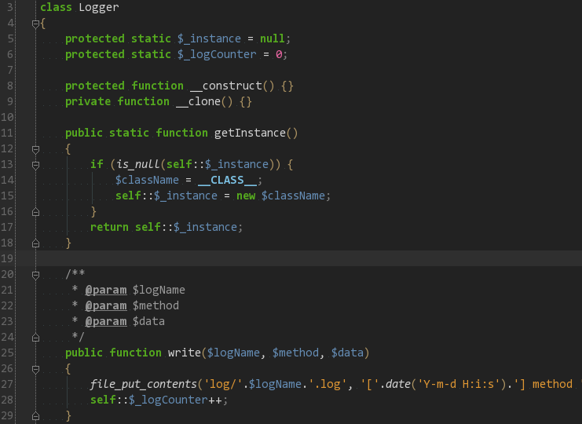
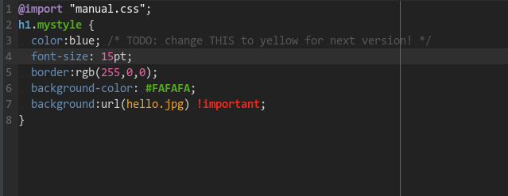

Dark theme for PHPStorm (zhk-dark-theme)
===========================

## Looks like ...

###PHP

###HTML

###Javascript

###CSS

##How to install
    
Mac:

    Copy theme file at ~/Library/Preferences/WebIDE60/colors/zhk_dark.xml (PHPStorm >= 6, zhk_dark.icls)

Linux:

    Copy theme file at ~/.WebIde60/config/colors/zhk_dark.xml (PHPStorm >= 6, zhk_dark.icls)

Windows:

    Copy theme file at C:\Documents and Settings\<Your username>\.WebIde60\config\colors\zhk_dark.xml (PHPStorm >= 6, zhk_dark.icls)
